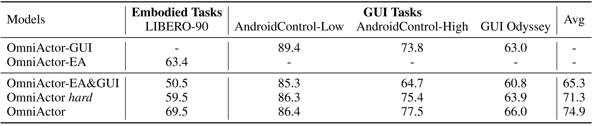

<div align="center">
  <h1>OmniActor: A Generalist GUI and Embodied Agent for 2D&3D Worlds</h1>
</div>

<div align="center">
<!-- <a href='https://arxiv.org/abs/2507.15509'></a>&ensp;<a href='https://huggingface.co/collections/DocTron/chart-r1-68834834a239e09e9abcb5f4'></a>&ensp;<a href=https://github.com/tatsu-lab/stanford_alpaca/blob/main/LICENSE></a> -->
</a>


Longrong Yang, Zhixiong Zeng*, Yufeng Zhong, Jing Huang, Liming Zheng, <br>
Lei Chen, Haibo Qiu, Zequn Qin, Lin Ma†, Xi Li†
</div>
<div align="center">
<strong>Meituan Group</strong>
</div>
<div align="center">
* Project leader. † Corresponding authors. 
</div>


---
**OmniActor** is an open-source high-performance generalist agent for GUI tasks in the 2D virtual world and embodied tasks in the 3D real world. OmniActor proposes Layer-heterogeneity MoE to eliminate the conflict between GUI and embodied data by separating deep-layer parameters, while leverage their synergy by sharing shallow-layer parameters, resembling the cerebrum-cerebellum mechanism in the human brain. By successfully leveraging the synergy and eliminating the conflict, OmniActor outperforms agents only trained by GUI or embodied data in GUI or embodied tasks. Furthermore, OmniActor unifies the action spaces of GUI and embodied tasks, and collect large-scale GUI and embodied data from various sources for training. This significantly improves OmniActor under different environments.
<div align="center">

</div>

## 📢 News and Updates
* ```2025.09.05``` Codes and models are coming soon.
* ```2025.09.05``` 🔥🔥🔥 We release the technical report of **OmniActor**.


## 🤗 Models
| Model                | Base MLLM    | Download Link |
| --------------------- | ------------ | ------------- |
| OmniActor-GUI         | Qwen2-VL 7B  | -             |
| OmniActor-EA          | Qwen2-VL 7B  | -             |
| OmniActor-EA&GUI      | Qwen2-VL 7B  | -             |
| OmniActor hard        | Qwen2-VL 7B  | -             |
| OmniActor             | Qwen2-VL 7B  | -             |

OmniActor-GUI: Use GUI data to train.

OmniActor-EA: Use embodied data to train.

OmniActor-EA&GUI: Mix GUI and embodied data to train.

OmniActor hard: Mix GUI and embodied data to train. Parameters of attention heads, FFNs, and classification heads are totally separated.

OmniActor: Mix GUI and embodied data to train. Parameters in shallow layers are shared, and parameters in deep layers are separated.


## 📊 Performance
### Comparison between different agents on embodied tasks and GUI tasks:
<div align="center">

</div>

### Study about different OmniActor variants:
<div align="center">

</div>

## 📌 Acknowledgement
We sincerely appreciate [LLaMA-Factory](https://github.com/hiyouga/LLaMA-Factory) and [UItron](https://github.com/UITron-hub/UItron) for providing reference training frameworks.

